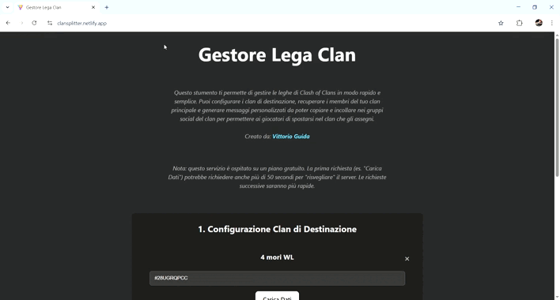

# 🏰 ClanSplitter per Clash of Clans (Demo)

ClanSplitter è una piccola applicazione web, legata al mondo del videogioco Clash of Clans, pensata per aiutare il capo e co-capi a organizzare la CWL (Lega delle Guerre tra Clan): recupera i membri di un clan principale, li ordina per TH e ti permette di suddividerli rapidamente in più clan, generando messaggi pronti da condividere.

Attualmente deployata al seguente URL: https://clansplitter.netlify.app/         

## ⚡️ Funzionalità

   -   **Configurazione dinamica dei clan:** Aggiungi, modifica e rimuovi un numero qualsiasi di clan di destinazione.
   -   **Caricamento automatico dei dati:** Inserendo il tag di un clan, l'app recupera automaticamente il nome, la lega e genera il link di invito.
   -   **Recupero membri del clan principale:** Carica e visualizza la lista completa dei membri del tuo clan, ordinata per livello del Municipio (TH).
   -   **Assegnazione semplificata:** Con un semplice clic, assegna ogni giocatore a uno dei clan di destinazione.
   -   **Rimozione rapida:** Con un semplice clic, è possibile rimuovere i player dai clan di destinezione, inserendoli nuovamente nel clan principale.
   -   **Generazione automatica di messaggi:** Crea messaggi di testo formattati per ogni clan, con la lista dei giocatori assegnati, pronti per essere copiati.
   -   **Salvataggio locale:** Tutte le configurazioni dei clan vengono salvate nel browser, quindi non è necessario reinserirle a ogni avvio.

⚠️ Limitazioni:
   - **Cold start (Render free):** *La prima chiamata dopo un periodo di inattività può essere lenta; le successive sono rapide.* 
   - 💡 È possibile utilizzare un servizio di ping come *Cron-job* per mantenere il serve semrpe attivo.*

## 🎬 Demo Video


## 💻 Tecnologie Utilizzate
L'applicazione è costruita con un'architettura ibrida:
   -   **Frontend:**
         - *React (Vite)* 
         - ospitata su *Netlify*
   -   **Backend:**
         - *Node.js (Express)*
         - *API di Clash of Clans*
         - Proxy RoyaleAPI per ottenere un IP statico necessaro alle API di Clash of Clans.
         - ospitato su *Render* 

## 📁 Struttura del progetto

```
clanSplitter-serverized/
├── public/                 
│   └── vite.svg            → Logo app default
│          
├── server/                 
│   ├── package-lock.json   → Versioni delle dipendenze
│   ├── package.json        → Dipendenze per il server
│   └── server.js           → Codice del server (back-end) che comunica con L'API di Clash of Clans
│
├── src/                    
│   ├── App.css             → CSS per App.jsx
│   ├── App.jsx             → Componente React principale (front-end)
│   ├── assets/             → Eventuali immagini
│   ├── index.css           → Stili CSS globali
│   └── main.jsx            → Punto di ingresso per il codice lato client
│
├── .gitignore              → File e cartelle da ignorare per Git
├── .eslintrc.cjs           → Configurazione di ESLint
├── index.html              → Pagina HTML principale
├── netlify.toml            → Configurazione per il deploy su Netlify
├── package-lock.json       → Versioni delle dipendenze del progetto
├── package.json            → Dipendenze del progetto
├── README.md               → Documentazione del progetto
└── vite.config.js          → Configurazione per Vite
```

### 👷🏻‍♂️ Autore: Vittorio Guida


